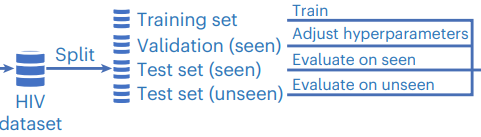

## DeepAAI Train

* 如上图所示，DeepAAI训练的每个 epoch 包括：
  * （seen）训练模型
  * （seen）验证
  * （seen）测试
  * （unseen）测试
* 因此，模型首先通过seen数据学习如何量化Abs之间的关系，再应用于unseen数据

## My Understanding **

原DeepAAI的model部分的算法是：

1. 从Ab和Ag各自的图结构中提取结点的 global 和 local 特征
2. 组合并处理Ab和Ag的 global 特征得到 global pair ft
3. 组合并处理Ab和Ag的 local 特征得到 local pair ft
4. 处理 global pair ft 和 local pair ft，预测结果

修改后，DeepAAI的功能变为 提取 Ab 和 Ag 的 embedding，再生成表示 Ab和Ag 关系的二分图……

#### 先DeepAAI，再用GCN、GAT处理二分图，是否重复？

> 不重复（？？）
>
> DeepAAI的图结构是Abs关系图，Ags关系图，重点是提取出node ft
>
> 而二分图的图结构是 Ab-Ag 中和关系图

## DeepAAI Modification

* 算法修改：不先组合Ab和Ag的特征，而是先组合global和local（去除组合Ab和Ag的部分）
  1. 从图结构中提取结点的 global 和 local 特征
  2. 组合并处理 global 和 local，得到 total_ft
* 故：分别处理Ab和Ag（模型类似）
