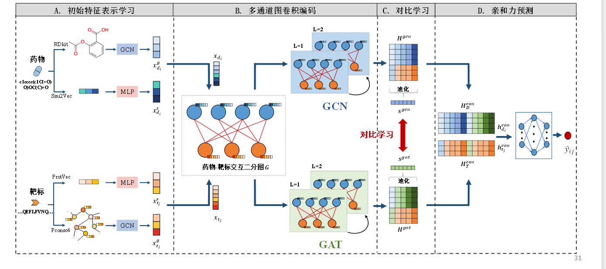

## Method

--7.17--

* 模型分为3个部分：

  1. AntisEmbed：提取Antibody和Antigen的特征
  2. AffinityGraphGenerator：二分图生成

  3. GCN & GAT process：处理二分图
  4. CL：对比学习
  5. Predictor：预测中和性能

## Structure

## Models

### MLP

* 多层感知机

* 前馈人工神经网络，包含：
  * 输入层
  * 隐藏层：全连接
  * 输出层

### GATs

* 图注意力机制，具体于GATs.md

### GCNs

* 图卷积网络，具体于GCNs.md

